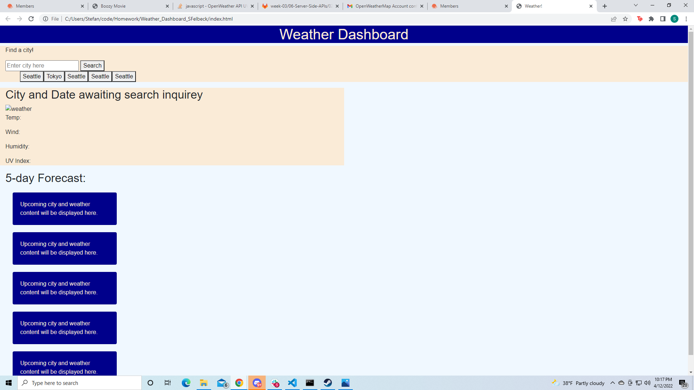
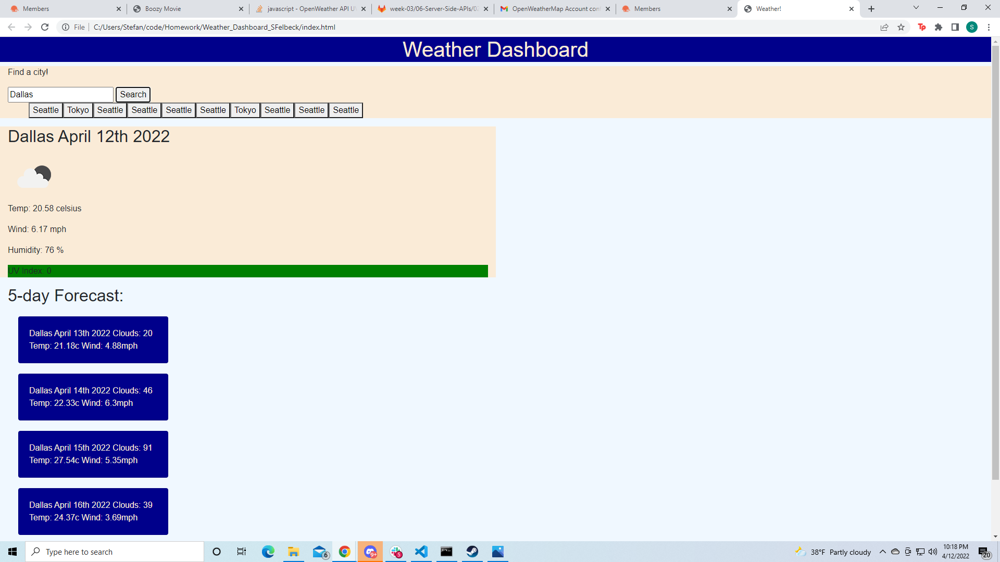

# Weather_Dashboard_SFelbeck

This assignment posed a decent issue but ultimately I was able to prevail! (mostly I couldn't figure out how to get me previous search buttons to work.)
I had a lot of initial trouble figureing out my api calls but help from classmates and TAs put me on the right track and with some additional help I was able to figure out the rest of the code from there.
In this assignment I went with very minimal css because I knew the javascript was gonna be a lot to handle, it doesnt look pretty but it gets the job done!
I was also surprised to find that I needed a second api call with the latitude and longetude for the uv index and upcoming forecasts.
One of the biggest hurdles occured during one of my unsuccessful attemps to implement previous search buttons when I accidentally created an infinite loop of new buttons all calling the api and got my openweathermap account automatically banned for too many api calls within a minute.

Below you can find screenshots of the application in action!

